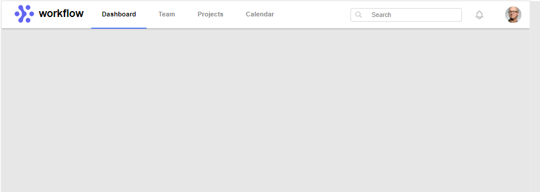
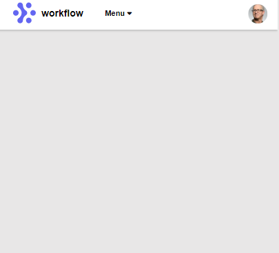
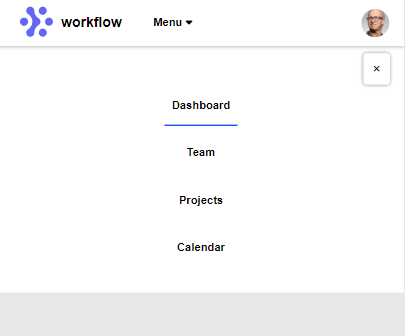

<============For Hero Page=========>
1. Hero Page in Desktop View

2. Hero Page in Mobile View

3.Hero Page with Hamburger Menu

For the hamburger menu I made a separate menu for the mobile view which I made hideen in desktop view and in max-width of 767px I made it visible using display block and hide the menu which displayed in desktop view using display none. Then using the jquery I select the bar button with click event, which after clicking will be hidden in 100 milisecond by showing the mobile navigation links and cross button.
Similarly, I select the cross button with click event, which after clicking will be hidden, also hide the mobile navigation links and show the bar button. Timing is used inside the small bracket to provide transition make it looks attractive.

<============For Nav Page=========>
1. Nav Page in Desktop View

2. Nav Page in Mobile View

3.Nav Page with Mobile Navigation Menu

For the mobile navigation menu I have used a menu li inside the navbar which will only display in the width of 1200px due to the number of items present in the navbar like logo image, logo text, nav ul links, search field, notification logo and user profile image which messed up when the width is below 1200px. While clicking the menu with carret down icon which represents the dropdown items I select the menu with click event using the id in jquery and using the toggle event I displayed the menu items if it is hidden and hide if it is displayed and same  toggle event for cross button. Similarly, I select the cross button using the id with the click event and after clicking the cross button I hide the navigation links using the hide function and hide the cross button itself. The number inside the brackets represent the timing of the executing of the event which is in miliseconds.
